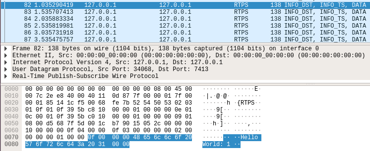
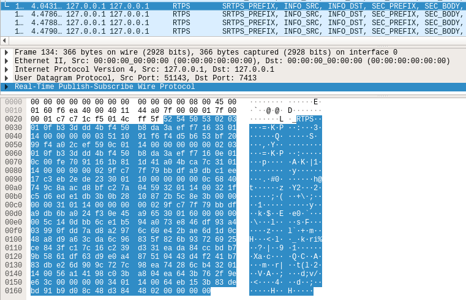

# SROS2
In this part of the workshop a ROS2 workspace with example applications is set up and secured with SROS2.

You will find the following examples in this document:
 1. [Example with minimal publisher and subscriber](#example-with-minimal-publisher-and-subscriber)
 2. [Example with secured communication](#example-with-secured-communication)
 3. [Example with secured communication on different machines](#example-with-secured-communication-on-different-machines)
 4. [Example with access control](#example-with-access-control)

## Installation
### 1. Build docker image
The ```docker build``` command builds Docker images from a Dockerfile. This [Dockerfile](Docker/Dockerfile) is used here. The *-t* option creates a tag for the resulting image. The repository name will be *ros2image* and the tag will be *df*.
~~~~
cd Part2_SROS2/Docker/
docker build -t ros2image:df .
~~~~

### 2. Create docker container
The ```docker create``` command creates a writeable container layer over the specified image *ros2image:df* and prepares it for running the specified command. The *-it* option instructs Docker to create an interactive bash shell in the container. The *--network=host* option shares the host’s networking, and the container does not get its own IP-address assigned. The *--name* option assigns a name (*ros2container*) to the container.
~~~~
docker create -it --network=host --name ros2container ros2image:df
~~~~

### 3. Start docker container
The ```docker start``` command starts one or more stopped containers.
~~~~
docker start ros2container
~~~~

### 4. Connect to running docker container
The ```docker exec``` command runs a new command in a running container. The following command creates a new Bash shell in the container *ros2container*.
~~~~
docker exec -it ros2container bash
~~~~

After the bash is available you should see something similar like:
~~~~
root@pchostname:~/ros2_example_ws#
~~~~

## ROS2
The Robot Operating System (ROS) is a set of software libraries and tools that help you build robot applications. Here you will find a manual on how use software from ROS2, which is a new version of ROS that is under heavy development.

To use ROS2 you have to source the environment of an existing ROS2 installation. This environment is called an **underlay**. That will provide your workspace with the necessary build dependencies for the example packages. This is achieved by sourcing the setup script.
~~~~
source /opt/ros/dashing/setup.bash
~~~~

With the environment sourced you can run ros2 commands. Run ```ros2 --help``` to see all available commands.
~~~~
ros2 --help
~~~~

The following output is printed:
~~~~
ros2 is an extensible command-line tool for ROS 2.

Commands:
  action     Various action related sub-commands
  component  Various component related sub-commands
  daemon     Various daemon related sub-commands
  launch     Run a launch file
  lifecycle  Various lifecycle related sub-commands
  msg        Various msg related sub-commands
  multicast  Various multicast related sub-commands
  node       Various node related sub-commands
  param      Various param related sub-commands
  pkg        Various package related sub-commands
  run        Run a package specific executable
  security   Various security related sub-commands
  service    Various service related sub-commands
  srv        Various srv related sub-commands
  topic      Various topic related sub-commands
~~~~

### Example with minimal publisher and subscriber
In the previously created docker container are pre-build executables installed. Now, you want to start a new publisher and subscriber node. Run the nodes in one single container via **two seperate shells**. (See [Connect to running docker container](#4-connect-to-running-docker-container))

Before you can use any of the installed executables or libraries in the container, you have to source the setup scripts.
~~~~
source install/setup.bash
~~~~

With the ros command ```ros2 run``` you can start a new publisher and subscriber node.

Publisher:
~~~~
ros2 run examples_rclpy_minimal_publisher publisher_member_function
~~~~
~~~~
[INFO] [minimal_publisher]: Publishing: "Hello World: 0"
[INFO] [minimal_publisher]: Publishing: "Hello World: 1"
[INFO] [minimal_publisher]: Publishing: "Hello World: 2"
[INFO] [minimal_publisher]: Publishing: "Hello World: 3"
...
~~~~

Subscriber:
~~~~
ros2 run examples_rclpy_minimal_subscriber subscriber_member_function
~~~~
~~~~
[INFO] [minimal_subscriber]: I heard: "Hello World: 0"
[INFO] [minimal_subscriber]: I heard: "Hello World: 1"
[INFO] [minimal_subscriber]: I heard: "Hello World: 2"
[INFO] [minimal_subscriber]: I heard: "Hello World: 3"
...
~~~~

#### Analyze communication
The ROS2 communication of the example nodes can be analyzed with [Wireshark](https://www.wireshark.org/). Because the docker container is using the host’s networking, the communication is available at the local loopback. Wireshark prints the following output when listening on the local loopback interface:



In the above figure you can see a detailed overview of a ROS2 message transmitted via Real-Time Publish-Subscribe (RTPS) Protocol. ROS 2 builds on top of DDS. It is compatible with multiple DDS or RTPS (the DDS wire protocol) vendors. By default the eProsima’s FastRTPS is included in the workspace and it is the default middleware.

## ROS2 security (SROS2)
[SROS2](https://github.com/ros2/sros2) provides tools to use ROS2 on top of [DDS Security](https://www.omg.org/spec/DDS-SECURITY). DDS-Security enables out-of-the box security and interoperability between compliant DDS applications. A user is able to customize the behavior of the DDS implementations through specifying technologies for Authentication, Access Control, Encryption, Message Authentication, Digital Signing, Logging and Data Tagging. 

The SROS2 tools are available with the ```ros2 security``` command. To see all existing sub-commands run the following command.
~~~~
ros2 security --help
~~~~

The following output is printed:
~~~~
Various security related sub-commands

Commands:
  create_key          Create key
  create_keystore     Create keystore
  create_permission   Create permission
  distribute_key      Distribute key
  generate_artifacts  Generate keys and permission files from a list of identities and policy files
  generate_policy     Generate XML policy file from ROS graph data
  list_keys           List keys
~~~~

The individual commands are described [here](Part2_SROS2/sros2commands.md) in more detail.


## Example with secured communication
The previously created example ([Example with minimal publisher and subscriber](#example-with-minimal-publisher-and-subscriber)) will now be secured with SROS2. This means that the nodes will be communicating using authentication and encryption! Therefore stop both nodes, the publisher and the subscriber, by pressing *Crtl+C*. You should see the following output in both shells:

~~~~
root@pchostname:~/ros2_example_ws#
~~~~

Perform the following steps in one of the two shells:
~~~~
ros2 security create_keystore keystore
ros2 security create_key keystore /minimal_publisher
ros2 security create_key keystore /minimal_subscriber
~~~~

Activate the secured communication in both shells (for both nodes):
~~~~
export ROS_SECURITY_ROOT_DIRECTORY=keystore
export ROS_SECURITY_ENABLE=true
export ROS_SECURITY_STRATEGY=Enforce
~~~~


Start publisher node:
~~~~
ros2 run examples_rclpy_minimal_publisher publisher_member_function
~~~~

Output:
~~~~
[INFO] [rcl]: Found security directory: keystore/minimal_publisher
[INFO] [minimal_publisher]: Publishing: "Hello World: 0"
[INFO] [minimal_publisher]: Publishing: "Hello World: 1"
[INFO] [minimal_publisher]: Publishing: "Hello World: 2"
[INFO] [minimal_publisher]: Publishing: "Hello World: 3"
...
~~~~


Start subscriber node:
~~~~
ros2 run examples_rclpy_minimal_subscriber subscriber_member_function
~~~~

Output:
~~~~
[INFO] [rcl]: Found security directory: keystore/minimal_subscriber
[INFO] [minimal_subscriber]: I heard: "Hello World: 0"
[INFO] [minimal_subscriber]: I heard: "Hello World: 1"
[INFO] [minimal_subscriber]: I heard: "Hello World: 2"
[INFO] [minimal_subscriber]: I heard: "Hello World: 3"
...
~~~~

### Analyze (secured) communication
The ROS2 communication of the example nodes can be analyzed with Wireshark. Because the docker container is using the host’s networking, the communication is available at the local loopback. Wireshark prints the following output when listening on the local loopback interface:



In the above figure you can see the encrypted communication. Compared to the [previous figure](#analyze-communication) you can not read the message content any more.

These nodes are able to communicate because they have appropriate keys and certificates. However, other nodes will not be able to communicate, e.g. the following attempt to start a another subscriber with a name that is not associated with valid keys/certificates will fail:
~~~~
export ROS_SECURITY_ROOT_DIRECTORY=keystore
export ROS_SECURITY_ENABLE=true
export ROS_SECURITY_STRATEGY=Enforce

ros2 run examples_rclpy_minimal_subscriber subscriber_member_function __node:=not_minimal_subscriber
~~~~

Output:
~~~~
SECURITY ERROR: directory keystore/not_minimal_subscriber does not exist.
~~~~

## Example with secured communication on different machines
In the previous setup two ROS2 nodes were running in the same docker container and communicated over localhost. That's good, but it's more exciting when multiple machines are involved, since the benefits of authentication and encryption are more obvious. With docker it is possible to represent multiple machines as multiple docker containers which are communicating via the virtual docker network.

First, you have to create new docker containers representing a certificate authority, a publishing machine and a subscribing machine. For this example the docker containers are created without the option *--network=host*, so docker creates a virtual network and assigns IP addresses to the containers.

~~~~
docker create -it --name ros2containerca ros2image:df
docker create -it --name ros2containerpub ros2image:df
docker create -it --name ros2containersub ros2image:df
~~~~

Start the containers:
~~~~
docker start ros2containerca
docker start ros2containerpub
docker start ros2containersub
~~~~

Inspect the docker network:
~~~~
docker network inspect bridge
~~~~

You should see a similar output:
~~~~
...
"Containers": {
    "47d7a6104359038af0b610bb162df520d944888d5fee7a301a25b60c40f29baf": {
    "Name": "ros2containersub",
    "EndpointID": "fe306cb273f2909ec4e7b506d84c3288aa4980af69f1ad69be42e1b0840b7722",
    "MacAddress": "02:42:ac:11:00:04",
    "IPv4Address": "172.17.0.4/16",
    "IPv6Address": ""
    },
    "50878df6ff0bbb23c17d69ebef22c10d29690fd52f9cbd2a6700154d4f89ece6": {
    "Name": "ros2containerca",
    "EndpointID": "bb0c5a1fd60bc1a74da25b122bfa338858e8adddcd5790c58b1c7ba84c956be3",
    "MacAddress": "02:42:ac:11:00:02",
    "IPv4Address": "172.17.0.2/16",
    "IPv6Address": ""
    },
    "897e1b8b447dbc12686929d5c982f35cb9afac9593282d8d63e3fd82f9114b3f": {
    "Name": "ros2containerpub",
    "EndpointID": "3963a40f4341652c6955c736724ca2e2051b0380688a1eaaa8491a3cc19bc150",
    "MacAddress": "02:42:ac:11:00:03",
    "IPv4Address": "172.17.0.3/16",
    "IPv6Address": ""
    }
},
...
~~~~

>Note: If the IP addresses in your network do not match, adopt them in the following commands!

Connect the docker containers in seperate shells:
~~~~
docker exec -it ros2containerca bash
~~~~
~~~~
docker exec -it ros2containerpub bash
~~~~
~~~~
docker exec -it ros2containersub bash
~~~~

### Additional information
In this example the keys and certificates are created in a different way compared to the previous example ([Example with secured communication](#example-with-secured-communication)). This means that not all SROS2 tools are used like before, because the SROS2 tools requires the private keys to be present at the keystore of the certificate authority. In a real application where multiple and independent partners are implementing their ROS2 nodes on different machines, nobody want to provide their private key to a central CA in order to create the certificates. Therefore, the private keys have to remain the node's side. In the following manual you can see how all necessary files can be created without giving away any private key from the prespective owner.

### Create a keystore for the certificate authority (CA)

#### Run the following commands in the *ros2containerca* container:
Create a keystore at the CA that the CA can store all the necessary files to digitally sign documents.
~~~~
ros2 security create_keystore keystore
mkdir keystore/minimal_publisher
mkdir keystore/minimal_subscriber
~~~~

### Create keys and certificates for the publisher node

#### Run the following commands in the *ros2containerpub* container:
Create a keystore directory for the publisher node and copy the template configuration file *request.cnf* for creating certificate requests in the keystore.
~~~~
mkdir -p keystore/minimal_publisher
cp /root/request.cnf /root/ros2_example_ws/keystore/minimal_publisher/request.cnf
~~~~

You have to change the name of the node to */minimal_publisher* in the *request.cnf* configuration file. The following command uses the *nano* editor to edit the file, but you can also install and use a different one.
~~~~
nano /root/ros2_example_ws/keystore/minimal_publisher/request.cnf
~~~~

The *request.cnf* file should look like this:
~~~~
prompt = no
string_mask = utf8only
distinguished_name = req_distinguished_name

[ req_distinguished_name ]
commonName = /minimal_publisher
~~~~

After the configuration file is ready, the private key and the corresponding certificate request of the publisher node can be created.
~~~~
openssl ecparam -name prime256v1 > keystore/minimal_publisher/ecdsaparam
openssl req -nodes -new -newkey ec:keystore/minimal_publisher/ecdsaparam -keyout keystore/minimal_publisher/key.pem -out keystore/minimal_publisher/req.pem -config keystore/minimal_publisher/request.cnf
~~~~

The certificate request must be sent to the certification authority to afterwards create and sign the resulting certificate.


 > Make sure the IP adress in the command below is the one of the ros2containerca container. You have gathered this information above with `docker network inspect bridge`.

~~~~
scp keystore/minimal_publisher/req.pem root@172.17.0.2:/root/ros2_example_ws/keystore/minimal_publisher/req.pem
~~~~
The password for the root user is: **root**


#### Run the following commands in the *ros2containerca* container:
Create the publisher's certificate with the help of the CA.
~~~~
cd keystore/
openssl ca -batch -create_serial -config ca_conf.cnf -days 3650 -in minimal_publisher/req.pem -out minimal_publisher/cert.pem
cd ..
~~~~

Copy and edit the *policy.xml* file for the creation of the *permissions.xml* file, which is the next step.
~~~~
cp /root/policy.xml /root/ros2_example_ws/keystore/minimal_publisher/policy.xml
~~~~

Set the name of the node to *minimal_publisher* in the *policy.xml* file.
~~~~
nano keystore/minimal_publisher/policy.xml
~~~~

The *policy.xml* file should look like this:
~~~~
<?xml version="1.0" encoding="UTF-8"?>
<policy version="0.1.0">
  <profiles>
    <profile ns="/" node="minimal_publisher">
      <topics publish="ALLOW" subscribe="ALLOW">
        <topic>/*</topic>
      </topics>
      <services reply="ALLOW" request="ALLOW">
        <service>/*</service>
      </services>
      <actions call="ALLOW" execute="ALLOW">
        <action>/*</action>
      </actions>
    </profile>
  </profiles>
</policy>
~~~~

~~~~
ros2 security create_permission keystore /minimal_publisher keystore/minimal_publisher/policy.xml
~~~~

### Create keys and certificates for the subscriber node

#### Run the following commands in the *ros2containersub* container:
Create a keystore directory for the subscriber node and copy the template configuration file *request.cnf* for creating certificate requests in the keystore.
~~~~
mkdir -p keystore/minimal_subscriber
cp /root/request.cnf /root/ros2_example_ws/keystore/minimal_subscriber/request.cnf
~~~~

You have to change the name of the node to */minimal_subscriber* in the *request.cnf* configuration file. The following command uses the *nano* editor to edit the file, but you can also install and use a different one.
~~~~
nano /root/ros2_example_ws/keystore/minimal_subscriber/request.cnf
~~~~

The *request.cnf* file should look like this:
~~~~
prompt = no
string_mask = utf8only
distinguished_name = req_distinguished_name

[ req_distinguished_name ]
commonName = /minimal_subscriber
~~~~

After the configuration file is ready, the private key and the corresponding certificate request of the subscriber node can be created.
~~~~
openssl ecparam -name prime256v1 > keystore/minimal_subscriber/ecdsaparam
openssl req -nodes -new -newkey ec:keystore/minimal_subscriber/ecdsaparam -keyout keystore/minimal_subscriber/key.pem -out keystore/minimal_subscriber/req.pem -config keystore/minimal_subscriber/request.cnf
~~~~

The certificate request must be sent to the certification authority to afterwards create and sign the resulting certificate.

 > Make sure the IP adress in the command below is the one of the ros2containerca container. You have gathered this information above with `docker network inspect bridge`.
 
~~~~
scp keystore/minimal_subscriber/req.pem root@172.17.0.2:/root/ros2_example_ws/keystore/minimal_subscriber/req.pem
~~~~
The password for the root user is: **root**


#### Run the following commands in the *ros2containerca* container:
Create the subscribers's certificate with the help of the CA.
~~~~
cd keystore/
openssl ca -batch -create_serial -config ca_conf.cnf -days 3650 -in minimal_subscriber/req.pem -out minimal_subscriber/cert.pem
cd ..
~~~~

Copy and edit the *policy.xml* file for the creation of the *permissions.xml* file.
~~~~
cp /root/policy.xml /root/ros2_example_ws/keystore/minimal_subscriber/policy.xml
~~~~

Set the name of the node to *minimal_subscriber* in the *policy.xml* file.
~~~~
nano keystore/minimal_subscriber/policy.xml
~~~~

The *policy.xml* file should look like this:
~~~~
<?xml version="1.0" encoding="UTF-8"?>
<policy version="0.1.0">
  <profiles>
    <profile ns="/" node="minimal_subscriber">
      <topics publish="ALLOW" subscribe="ALLOW">
        <topic>/*</topic>
      </topics>
      <services reply="ALLOW" request="ALLOW">
        <service>/*</service>
      </services>
      <actions call="ALLOW" execute="ALLOW">
        <action>/*</action>
      </actions>
    </profile>
  </profiles>
</policy>
~~~~

Generate and sign the permissions file:
~~~~
ros2 security create_permission keystore /minimal_subscriber keystore/minimal_subscriber/policy.xml
~~~~

### Distribute keys and certifiactes from CA to the publisher and the subscriber

#### Run the following commands in the *ros2containerca* container:
Make some already existing files available for the publisher and subscriber node by copying the files in the corresponding directory:
~~~~
cp keystore/governance.p7s keystore/minimal_publisher/governance.p7s
cp keystore/ca.cert.pem keystore/minimal_publisher/identity_ca.cert.pem
cp keystore/ca.cert.pem keystore/minimal_publisher/permissions_ca.cert.pem

cp keystore/governance.p7s keystore/minimal_subscriber/governance.p7s
cp keystore/ca.cert.pem keystore/minimal_subscriber/identity_ca.cert.pem
cp keystore/ca.cert.pem keystore/minimal_subscriber/permissions_ca.cert.pem
~~~~

**Very important!**

Protect the private key of the CA and do not copy it to any other ROS2 node, docker container or physical machine! It is also recommended to encrypt the private key with a password. (For simplicity the private key is not encrypted in this example!) The following command moves the private key of the CA out of the keystore because the whole directory is copyed to the publisher and subscriber node in the next step.
~~~~
mv /root/ros2_example_ws/keystore/ca.key.pem /root/ros2_example_ws/ca.key.pem
~~~~

Copy files to publisher:
~~~~
scp -r /root/ros2_example_ws/keystore/ root@172.17.0.3:/root/ros2_example_ws/
~~~~

Copy files to subscriber:
~~~~
scp -r /root/ros2_example_ws/keystore/ root@172.17.0.4:/root/ros2_example_ws/
~~~~

### Start the publisher and subscriber node
Now you are ready to start the publisher and subscriber node like you did it in the previous example ([Example with secured communication](#example-with-secured-communication)) but skip the key creation step. The resulting encrypted communicaiton should work as before.


## Example with access control
In the previous example ([Example with secured communication on different machines](#example-with-secured-communication-on-different-machines)) the nodes used authentication and encryption to communicated with each other, but they were not limited in access, which means that any authenticated node would be allowed to publish and subscribe to any topic data (aka message). To increase the level of security in the system, it is possible to define strict limits, known as access control, which restrict what each node is allowed to communicate. 

In this example, one subscriber node is allowed to subscribe to a particular topic, and another subscriber node is not allowed to subscribe to that topic.

### Create a second subscriber
~~~~
docker create -it --name ros2containersub2 ros2image:df
docker start ros2containersub2
docker exec -it ros2containersub2 bash
~~~~

### Adopt the access control of the nodes
#### Run the following commands in the *ros2containerca* container:
Create new keys and certificates for the subscriber2. For simplicity reasons you can do it with the SROS2 tools, but keep in mind that the private key of the subscriber2 is unprotected and present at the CA.
>Make sure that the private key of the CA is present in the keystore!
~~~~
ros2 security create_key keystore /minimal_subscriber2
~~~~

Copy the template *policy.xml* file:
~~~~
cp /root/policy.xml /root/ros2_example_ws/keystore/minimal_subscriber2/policy.xml
~~~~

Edit the *policy.xml* file accordingly to match the content below:
~~~~
nano keystore/minimal_subscriber2/policy.xml
~~~~

The following *policy.xml* file prevents the communication of the topic named "*topic*" for the subscriber node *minimal_subscriber2*:
~~~~
<?xml version="1.0" encoding="UTF-8"?>
<policy version="0.1.0">
  <profiles>
    <profile ns="/" node="minimal_subscriber2">
      <topics publish="ALLOW" subscribe="ALLOW">
        <topic>rosout</topic>
      </topics>
      <topics publish="DENY" subscribe="DENY">
        <topic>topic</topic>
      </topics>
      <services reply="ALLOW" request="ALLOW">
        <service>/*</service>
      </services>
      <actions call="ALLOW" execute="ALLOW">
        <action>/*</action>
      </actions>
    </profile>
  </profiles>
</policy>
~~~~

Generate and sign the permissions file:
~~~~
ros2 security create_permission keystore /minimal_subscriber2 keystore/minimal_subscriber2/policy.xml
~~~~

Copy the key files to the subscriber2:
> Make sure that you do not copy the private key of the CA!
~~~~
scp -r /root/ros2_example_ws/keystore/ root@172.17.0.5:/root/ros2_example_ws/
~~~~

#### Run the following commands in the *ros2containersub2* container:
Activate the secure communication for the *minimal_subscriber2* node:
~~~~
export ROS_SECURITY_ROOT_DIRECTORY=keystore
export ROS_SECURITY_ENABLE=true
export ROS_SECURITY_STRATEGY=Enforce
~~~~

Run the *minimal_subscriber* example with the correct name of the subscriber:
~~~~
ros2 run examples_rclpy_minimal_subscriber subscriber_member_function __node:=minimal_subscriber2
~~~~

The *minimal_subscriber2* node is not allowed to participate in this communication.

Output:
~~~~
...
[SECURITY Error] Error checking creation of local writer 81.92.67.64.70.1.b.80.f0.6d.92.34|0.0.2.3 
(rt/parameter_events topic not found in allow rule. (/tmp/binarydeb/ros-dashing-fastrtps-1.8.0/src/cpp/security/accesscontrol/Permissions.cpp:1111))
...
~~~~

This is the end of this workshop.